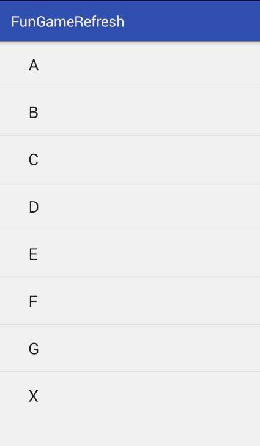

# FunGameRefreshView
有趣好玩的下拉刷新库, 你还记得小时候打的黑白掌上游戏机么？

# Preview

# FunGame

更新内容 
2016-07-28
- 当后台线程没有执行完毕的时候，松开手指，下拉刷新控件会回滚到游戏区域高度的位置，用户任然可以继续玩游戏。
- 重新整理了游戏区域中央的字符显示逻辑，不会再出现字符闪改的问题。

2016-08-01
- 修复当后台线程执行时间太短导致动画执行错误并无法操作游戏的问题。

    目前支持两种游戏：打砖块和打坦克
        打砖块规则简单，没有接住小球即GameOver;
        打坦克规则为：漏掉敌方坦克超过十辆或者与敌方坦克相撞即GameOver，看看你能不能坚持三分钟吧。嘿嘿~;

# Usage

    布局文件中：
    <com.zuck.swipe.hitblockrefresh.view.FunGameRefreshView
        android:id="@+id/refresh_hit_block"
        android:layout_width="match_parent"
        android:layout_height="wrap_content"
        app:game_type="hit_block">

        <ListView
            android:id="@+id/list_view"
            android:layout_width="fill_parent"
            android:layout_height="fill_parent"
            android:scrollbars="none">
        </ListView>
    </com.zuck.swipe.hitblockrefresh.view.FunGameRefreshView>

    Activity中：
        refreshView = (FunGameRefreshView) findViewById(R.id.refresh_fun_game);

        listView = (ListView) findViewById(R.id.list_view);

        arrayAdapter = new ArrayAdapter<String>(this, android.R.layout.simple_expandable_list_item_1, createDate());

        listView.setAdapter(arrayAdapter);
        refreshView.setOnRefreshListener(new FunGameRefreshView.FunGameRefreshListener() {
            @Override
            public void onRefreshing() {
                try {
                    // 模拟网络请求耗时动作
                    Thread.sleep(3000);
                } catch (InterruptedException e) {
                    e.printStackTrace();
                }
                mHandler.sendEmptyMessage(0);
            }
        });

    当刷新完毕后需要在主线程中调用：
        refreshView.finishRefreshing();

# Attributes

    支持下拉头部控件中游戏切换：
        <attr name="game_type" format="enum">
            <enum name="hit_block" value="0" />
            <enum name="battle_city" value="1" />
        </attr>

    支持游戏中各部分模型颜色自定义：
        <attr name="left_model_color" format="color" />
        <attr name="middle_model_color" format="color" />
        <attr name="right_model_color" format="color" />

    支持HitBlock游戏中砖块列数和小球速度自定义：
        <attr name="block_horizontal_num" format="integer" />
        <attr name="ball_speed" format="integer">
            <enum name="low" value="3" />
            <enum name="medium" value="6" />
            <enum name="fast" value="9" />
        </attr>

#Thanks

UI设计来自于：https://github.com/dasdom/BreakOutToRefresh

#Licence

MIT

