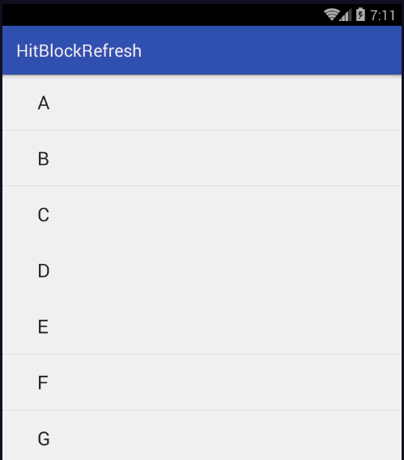

# SunBaby
有趣好玩的下拉刷新库, 你还记得小时候打的黑白掌上游戏机么？

# Preview

# Usage

    布局文件中：
    <com.zuck.swipe.hitblockrefresh.view.HitBlockRefreshView
        android:id="@+id/refresh_hit_block"
        android:layout_width="match_parent"
        android:layout_height="wrap_content"
        app:block_horizontal_num="3"
        app:ball_speed="medium">

        <ListView
            android:id="@+id/list_view"
            android:layout_width="fill_parent"
            android:layout_height="fill_parent"
            android:scrollbars="none" >
        </ListView>
    </com.zuck.swipe.hitblockrefresh.view.HitBlockRefreshView>

    Activity中：
        refreshView = (HitBlockRefreshView) findViewById(R.id.refresh_hit_block);

        listView = (ListView) findViewById(R.id.list_view);

        ArrayAdapter<String> arrayAdapter = new ArrayAdapter<String>(this, android.R.layout.simple_expandable_list_item_1, createDate());

        listView.setAdapter(arrayAdapter);
        refreshView.setOnRefreshListener(new HitBlockRefreshView.PullToRefreshListener() {
            @Override
            public void onRefresh() {
                try {
                    // 模拟网络请求耗时动作
                    Thread.sleep(2000);
                } catch (InterruptedException e) {
                    e.printStackTrace();
                }
                mHandler.sendEmptyMessage(0);
            }
        });

    当刷新完毕后需要在主线程中调用：
        refreshView.finishRefreshing();

# 自定义属性
    <attr name="block_horizontal_num" format="integer" />
    <attr name="ball_speed" format="integer">
        <enum name="low" value="3" />
        <enum name="medium" value="6" />
        <enum name="fast" value="9" />
    </attr>
    <attr name="block_color" format="color" />
    <attr name="ball_color" format="color" />
    <attr name="racket_color" format="color" />

    block_horizontal_num ：矩形块列数
    ball_speed : 小球弹射速度
    block_color : 矩形块颜色
    ball_color : 小球颜色
    racket_color : 挡板颜色

#Thanks
UI设计来自于：https://github.com/dasdom/BreakOutToRefresh

#Licence
Hitomis

